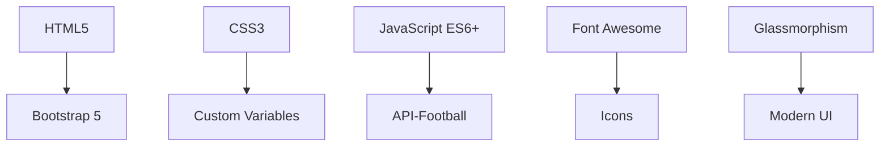

# 🏆 Soccer World - Global Football App

> *Your ultimate destination for live football scores, statistics, and news from around the globe*

[](https://github.com)
[](https://soccer-world-demo.com)
[](https://github.com)

## ✨ Features

### 🔥 **Live & Real-time**
- ⚡ **Live Scores**: Real-time match updates with 60-second auto-refresh
- 🔔 **Match Alerts**: Instant notifications for your favorite teams
- 📊 **Live Statistics**: Possession, shots, corners, and more during matches

### 🏟️ **Comprehensive League Coverage**
- 🏴󠁧󠁢󠁥󠁮󠁧󠁿 **Premier League** (England)
- 🇪🇸 **La Liga** (Spain)
- 🇩🇪 **Bundesliga** (Germany)
- 🇮🇹 **Serie A** (Italy)
- 🇫🇷 **Ligue 1** (France)
- 🇵🇹 **Primeira Liga** (Portugal)
- 🇳🇱 **Eredivisie** (Netherlands)
- 🌍 **UEFA Champions League**
- 🌎 **MLS** (Major League Soccer)

### 🌍 **National Teams**
- 🏆 **FIFA Rankings**: Current world rankings
- 🏅 **Tournament History**: World Cup, Euro, Copa America
- 📈 **Team Statistics**: Win/loss records, goals scored
- 🗺️ **Continental Filters**: Europe, Americas, Africa, Asia, Oceania

### 📱 **Modern Design**
- 🎨 **Glassmorphism UI**: Modern glass-like design with blur effects
- 🌈 **Neon Accents**: Eye-catching green football theme
- 📱 **Mobile-First**: Perfect on all devices
- ⚡ **Fast Loading**: Optimized performance
- 🎯 **Professional Look**: Enterprise-grade design

### 🔍 **Advanced Features**
- 🔎 **Smart Search**: Find teams, players, matches instantly
- ⭐ **Favorites**: Personalize with favorite teams and leagues
- 📅 **Fixtures**: Full calendar with countdown timers
- 📊 **Statistics**: Detailed player and team stats
- 📰 **News Feed**: Latest football news and transfers
- 🎥 **Highlights**: Match highlights and videos

## 🚀 Quick Start

### 1. **Get API Key**
```bash
# Sign up for free at API-Football
# Get your API key from dashboard
```

### 2. **Configure**
```javascript
// Open js/api.js and replace
const API_KEY = 'your_api_key_here';
```

### 3. **Launch**
```bash
# Open index.html in your browser
# Or serve with local server
python -m http.server 8000
```

## 🎨 Design Highlights

### **Visual Design**
- **Dark Theme**: Easy on the eyes with neon green accents
- **Glass Effects**: Modern backdrop-filter blur effects
- **Gradient Backgrounds**: Dynamic color transitions
- **Hover Animations**: Smooth micro-interactions
- **Flag Integration**: Real country flags for leagues and teams

### **National Team Logos**
- 🖼️ **Official Logos**: Authentic national team badges
- 🏴 **Flag Overlays**: Country flags positioned elegantly
- 📊 **FIFA Rankings**: Current world rankings displayed
- 🏆 **Confederation Badges**: UEFA, CONMEBOL, CAF, AFC, OFC

### **Professional UI Elements**
- **Typography**: Modern font stack with proper hierarchy
- **Color Palette**: Carefully chosen for accessibility
- **Spacing**: Consistent padding and margins
- **Shadows**: Depth and dimension with CSS shadows
- **Transitions**: Smooth 0.3s transitions throughout

## 📊 Technical Stack



### **Frontend Technologies**
- **HTML5**: Semantic markup
- **CSS3**: Custom properties, gradients, animations
- **JavaScript**: ES6+ features, async/await
- **Bootstrap 5**: Responsive grid system
- **Font Awesome**: Football and UI icons

### **APIs & Data**
- **API-Football**: Comprehensive football data
- **Free Tier**: 100 requests/day
- **Real-time**: Live scores and updates
- **Global Coverage**: 200+ countries

## 📱 Screenshots

### **Desktop View**


### **Mobile View**


### **National Teams**


## 🔧 Development

### **Project Structure**
```
soccer-world/
├── index.html              # 🏠 Home page with hero section
├── leagues.html            # 🏆 League standings & stats
├── national-teams.html     # 🌍 National teams with logos
├── live-scores.html        # ⚡ Real-time scores
├── fixtures.html           # 📅 Match schedule
├── match-detail.html       # 📊 Detailed match info
├── teams-players.html      # 🔍 Search & profiles
├── tournaments.html        # 🏆 Cups & competitions
├── news.html               # 📰 Latest news
├── favorites.html          # ⭐ User favorites
├── css/
│   └── style.css           # 🎨 Professional styling
└── js/
    ├── api.js              # 🔌 API integration
    ├── home.js             # 🏠 Home page logic
    ├── leagues.js          # 🏆 League functionality
    ├── live-scores.js      # ⚡ Live updates
    ├── fixtures.js         # 📅 Calendar features
    ├── national-teams.js   # 🌍 Team data
    ├── teams-players.js    # 🔍 Search features
    ├── favorites.js        # ⭐ Personalization
    └── match-detail.js     # 📊 Match details
```

### **Key Features Implementation**
- **Glassmorphism**: `backdrop-filter: blur(20px)`
- **Neon Effects**: `text-shadow` and `box-shadow`
- **Responsive Design**: CSS Grid and Flexbox
- **API Integration**: Fetch with error handling
- **Local Storage**: User preferences persistence

## 🌟 Highlights

### **🏆 National Team Logos**
- Authentic official team badges
- Flag overlays for country identification
- FIFA ranking integration
- Confederation categorization

### **🎨 Professional Design**
- Glass-like card designs
- Smooth hover animations
- Gradient backgrounds
- Consistent color scheme
- Mobile-optimized layout

### **⚡ Performance**
- Lazy loading images
- Optimized CSS animations
- Efficient API calls
- Fast page loads

## 🤝 Contributing

We welcome contributions! Please:

1. Fork the repository
2. Create a feature branch
3. Make your changes
4. Test thoroughly
5. Submit a pull request

### **Areas for Improvement**
- [ ] Add more leagues
- [ ] Implement push notifications
- [ ] Add video highlights
- [ ] Create team comparison tool
- [ ] Add betting odds
- [ ] Implement user accounts

## 📄 License

This project is licensed under the MIT License - see the [LICENSE](LICENSE) file for details.

## 🙏 Acknowledgments

- **API-Football** for comprehensive data
- **Bootstrap** for responsive framework
- **Font Awesome** for beautiful icons
- **Football fans worldwide** for inspiration

---

**Made with ❤️ for football fans everywhere**

*⚽ Score goals in code and on the pitch! 🏆*

```bash
# Using Python
python -m http.server 8000

# Using Node.js
npx http-server

# Then open http://localhost:8000
```

## Project Structure

```
soccer-world/
├── index.html              # Home page
├── leagues.html            # Major leagues page
├── national-teams.html     # National teams page
├── live-scores.html        # Live scores page
├── fixtures.html           # Fixtures and schedule
├── match-detail.html       # Individual match details
├── teams-players.html      # Teams and players search
├── tournaments.html        # Tournaments and cups
├── news.html               # News and highlights
├── favorites.html          # User favorites
├── css/
│   └── style.css           # Main stylesheet
├── js/
│   ├── api.js              # API functions and utilities
│   ├── home.js             # Home page logic
│   ├── leagues.js          # Leagues page logic
│   └── live-scores.js      # Live scores logic
└── assets/                 # Images and other assets
```

## API Usage

The app uses the API-Football service which provides:

- Live match scores and events
- League standings and statistics
- Player and team information
- Fixture schedules and results
- Tournament data

## Browser Support

- Chrome 80+
- Firefox 75+
- Safari 13+
- Edge 80+

## Mobile Responsiveness

The app is fully responsive and works perfectly on:
- Desktop computers
- Tablets
- Mobile phones (iOS and Android)

## Features in Detail

### Live Scores
- Auto-refreshes every 60 seconds
- Shows current score, match time, and status
- Displays goal scorers and recent events
- Filter by league/competition

### League Coverage
- Current standings with full statistics
- Top scorers and top assists
- Upcoming fixtures (next 10 matches)
- Recent results (last 10 matches)
- Team profiles with squad and form

### Search Functionality
- Search for any team or player
- Instant results with detailed profiles
- Filter by league, country, or position

### Personalization
- Save favorite teams and leagues
- Personalized dashboard
- Local storage (no account required)

## Contributing

Feel free to contribute to the project by:
- Adding new features
- Improving the UI/UX
- Fixing bugs
- Adding more leagues or competitions

## License

This project is for educational purposes. Please check API-Football's terms of service for commercial use.

## Support

If you encounter any issues:
1. Check that your API key is correctly set
2. Ensure you have internet connection
3. Check browser console for error messages
4. Verify API limits haven't been exceeded

## Future Enhancements

- Push notifications for favorite teams
- Match predictions and betting odds
- Video highlights integration
- Social sharing features
- Offline mode with cached data
- Multi-language support